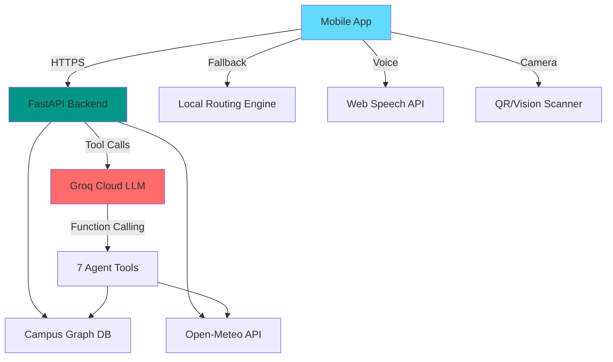

# 🎓 CampusIQ

<div align="center">

**Award-Winning Accessible Campus Navigation System**

*AI-Powered · Accessibility-First · Multilingual · Offline-Ready*

[](https://expo.dev)
[](https://reactnative.dev)
[](https://www.typescriptlang.org)
[](https://python.org)
[](https://fastapi.tiangolo.com)
[](https://groq.com)

[Features](#-features) • [Demo](#-demo) • [Quick Start](#-quick-start) • [Architecture](#-architecture) • [API Docs](#-api-documentation)

</div>

---

## 🌟 Overview

**CampusIQ** is a next-generation campus navigation assistant that uses conversational AI to help students, faculty, and visitors navigate campus facilities with **zero barriers**. Built for a hackathon, it demonstrates real-world accessibility innovation with production-ready architecture.

### 🎯 Problem Statement

Traditional campus navigation apps fail accessibility needs:
- ❌ Static maps don't adapt to wheelchair users or mobility restrictions
- ❌ Weather changes make outdoor routes unsafe
- ❌ Events/construction block paths without real-time updates
- ❌ Complex interfaces alienate users with visual/cognitive disabilities

### ✅ Our Solution

CampusIQ provides **intelligent, context-aware routing** through:
- ✨ **Conversational AI**: Ask in natural language, get personalized directions
- ♿ **Accessibility-First**: Step-free routes, elevator prioritization, audio guidance
- 🌦️ **Weather-Aware**: Covered routes during rain, shade recommendations in heat
- 🚧 **Event-Adaptive**: Real-time rerouting around blocked paths
- 🗣️ **Multilingual**: English, Hindi, Punjabi (voice + text)
- 📡 **Offline-Capable**: Works without internet or LLM backend

---

## ✨ Features

### 🤖 AI-Powered Navigation Agent

<table>
<tr>
<td width="50%">

**🧠 Zero-Hallucination Routing**
- Groq Cloud LLM (Llama 3.3 70B) with function calling
- Grounded in real campus graph data
- Multi-provider fallback (Groq → Azure → OpenAI → Local)
- Deterministic agent when offline (no API keys needed)

</td>
<td width="50%">

**🛠️ 7 Intelligent Tools**
1. `find_building` - Fuzzy place name search
2. `calculate_route` - Multi-criteria pathfinding
3. `get_weather_hint` - Real-time weather API
4. `get_pulse` - Cafeteria queues, parking, crowds
5. `get_events` - Event schedules, blocked paths
6. `get_hours` - Building open/close times
7. `get_safety_pois` - Emergency exits, AEDs

</td>
</tr>
</table>

### ♿ Accessibility Excellence

| Feature | Implementation | Impact |
|---------|---------------|---------|
| **Wheelchair Routing** | Graph costs penalize stairs/steps | 100% step-free paths |
| **Elevator Priority** | Preferred over ramps when available | Reduces fatigue |
| **Audio Guidance** | Text-to-speech in 3 languages | Vision-impaired support |
| **High Contrast UI** | WCAG AAA compliant colors | Low-vision friendly |
| **Voice Input** | Speech-to-text (Web Speech API) | Hands-free operation |
| **Screen Reader** | Semantic HTML, ARIA labels | Full keyboard nav |

### 🗺️ Advanced Routing Engine

```python
# Multi-criteria pathfinding with accessibility costs
Route Types:
├─ Fastest       # Shortest time (default for able-bodied)
├─ Accessible    # Zero stairs, elevator-equipped (wheelchair mode)
├─ Covered       # Max shelter from rain/sun (weather-aware)
├─ Quiet         # Avoids high-traffic zones (sensory-friendly)
└─ Scenic        # Outdoor routes with greenery (wellness mode)
```

**Smart Rerouting:**
- 🚧 Event-blocked paths → alternate route suggestions
- 🌧️ Rain detected → covered walkway prioritization  
- ⚡ Real-time campus pulse → avoid crowded areas
- 🚪 Building closed → show next-open time

### 🎨 Cross-Platform UI

<table>
<tr>
<td width="33%">

**📱 Mobile**
- Native iOS/Android (React Native)
- Gesture-based map controls
- Haptic feedback
- Push notifications
- Camera QR scanner

</td>
<td width="33%">

**🌐 Web**
- Progressive Web App (PWA)
- Desktop-optimized layout
- Keyboard shortcuts
- Responsive design
- Installable

</td>
<td width="33%">

**🗣️ Voice**
- 3 language support
- Text-to-speech output
- Speech-to-text input
- Accent-adaptive
- Hands-free mode

</td>
</tr>
</table>

### 🌍 Internationalization (i18n)

- **English** (en) - Primary
- **Hindi** (hi) - हिन्दी interface
- **Punjabi** (pa) - ਪੰਜਾਬੀ interface
- RTL layout support ready
- Dynamic locale switching

### 🚨 Emergency Features

**One-Tap Emergency Mode:**
- 📞 Direct security hotline calling
- 🚪 Nearest emergency exit routing
- 💓 AED station locator with distance
- 👥 Assembly point directions
- 🏥 Medical center fastest route
- ⚡ Location sharing with security

### 📊 Live Campus Pulse

Real-time facility monitoring:
- 🍽️ **Cafeteria Queue**: 15-min, 30-min, 45-min wait times
- 📚 **Library Seats**: Available study spaces
- 🚗 **Parking**: Lot A/B/C availability percentages
- 🏋️ **Gym Crowding**: Live occupancy levels
- 📅 **Event Conflicts**: Path blockages, reroute alerts

### 🎯 Additional Features

- ✅ **Building Directory**: 15+ campus facilities with hours/services
- ✅ **QR Code Scanner**: Instant landmark recognition
- ✅ **Photo Snap-to-Location**: Vision AI identifies buildings from photos
- ✅ **Offline Caching**: AsyncStorage for no-network operation
- ✅ **Dark Mode**: System-adaptive theming
- ✅ **Toast Notifications**: Non-intrusive feedback
- ✅ **Session Persistence**: Conversation history (20-message buffer)

---

## 🎬 Demo

### Screenshots

<table>
<tr>
<td><br/><sub><b>AI Chat Assistant</b></sub></td>
<td><br/><sub><b>Live Route Overlay</b></sub></td>
<td><br/><sub><b>Profile Settings</b></sub></td>
<td><br/><sub><b>Emergency Mode</b></sub></td>
</tr>
</table>

### Example Interactions

```
👤 User: "I need to get to the cafeteria, wheelchair accessible"
🤖 CampusIQ: "Central Cafeteria is 250m away (~4 min). I've selected a 
             step-free route with elevator access. Current queue time: 15 min.
             Want to see it on the map?"

👤 User: "Is the library open now?"
🤖 CampusIQ: "Central Library is open now (8:00 AM – 10:00 PM). 
             Currently 12 study seats available."

👤 User: "Covered route to engineering block, it's raining"
🤖 CampusIQ: "It's raining (22°C). I've found a fully covered route to 
             Engineering Block A via the connecting corridor. 180m, 3 min walk."
```

---

## 🚀 Quick Start

### Prerequisites

| Requirement | Version | Download |
|-------------|---------|----------|
| Node.js | 18+ | [nodejs.org](https://nodejs.org) |
| Python | 3.11+ | [python.org](https://python.org) |
| Groq API Key | Free | [console.groq.com](https://console.groq.com) |
| Expo CLI | Latest | `npm i -g expo-cli` |

### ⚡ 5-Minute Setup

#### 1️⃣ Clone & Install

```bash
git clone https://github.com/yourusername/campusiq.git
cd campusiq
npm install
```

#### 2️⃣ Configure Environment

```bash
# Frontend config
cp .env.example .env

# Backend config
cp backend/.env.example backend/.env
# Edit backend/.env and add: GROQ_API_KEY=gsk_your_key_here
```

#### 3️⃣ Start Backend (Python)

```bash
npm run backend
# or manually:
# cd backend
# python -m venv .venv
# source .venv/bin/activate  # Windows: .venv\Scripts\activate
# pip install -r requirements.txt
# uvicorn app.main:app --reload --host 0.0.0.0 --port 8000
```

Verify at [http://localhost:8000/health](http://localhost:8000/health):
```json
{
  "status": "ok",
  "llm": true,
  "provider": "groq",
  "model": "llama-3.3-70b-versatile"
}
```

#### 4️⃣ Start Frontend (Expo)

```bash
npm run dev
# or: npx expo start --clear
```

Scan QR code with Expo Go app (iOS/Android) or press:
- `w` - Open in web browser
- `i` - Open iOS simulator
- `a` - Open Android emulator

#### 5️⃣ Configure API Connection

**For physical devices:** Edit `.env`:
```env
EXPO_PUBLIC_API_URL=http://YOUR_LOCAL_IP:8000
EXPO_PUBLIC_USE_MOCK_API=false
```

Find your IP:
- **macOS/Linux**: `ifconfig | grep inet`
- **Windows**: `ipconfig` (look for IPv4 Address)

Restart Expo: `npx expo start --clear`

---

## 🏗️ Architecture

### Tech Stack

<table>
<tr>
<th>Layer</th>
<th>Technologies</th>
<th>Purpose</th>
</tr>
<tr>
<td><b>Frontend</b></td>
<td>

- Expo SDK 54
- React Native 0.81
- TypeScript 5.9
- Zustand (state)
- React Navigation 7
- i18next (i18n)

</td>
<td>Cross-platform UI (iOS/Android/Web)</td>
</tr>
<tr>
<td><b>Backend</b></td>
<td>

- Python 3.11+
- FastAPI 0.115
- Uvicorn (ASGI)
- Pydantic v2

</td>
<td>REST API, routing engine</td>
</tr>
<tr>
<td><b>AI Agent</b></td>
<td>

- Groq Cloud API
- Llama 3.3 70B Versatile
- Llama 3.2 90B Vision
- OpenAI function calling

</td>
<td>Conversational navigation</td>
</tr>
<tr>
<td><b>Routing</b></td>
<td>

- Dijkstra's algorithm
- Graph cost modeling
- Multi-criteria optimization

</td>
<td>Pathfinding with accessibility</td>
</tr>
<tr>
<td><b>Maps</b></td>
<td>

- React Native SVG
- Custom SVG campus map
- Polyline overlays

</td>
<td>Visual route rendering</td>
</tr>
<tr>
<td><b>External APIs</b></td>
<td>

- Open-Meteo (weather)
- Expo Speech
- Expo Camera
- Expo Location

</td>
<td>Real-time context data</td>
</tr>
</table>

### System Design



### Project Structure

```
campusiq/
├─ app/                          # Expo Router screens
│  ├─ (tabs)/                    # Bottom tab navigation
│  │  ├─ index.tsx              # Chat interface
│  │  ├─ map.tsx                # Interactive campus map
│  │  ├─ buildings.tsx          # Building directory
│  │  └─ profile.tsx            # Settings & accessibility
│  ├─ building/[id].tsx         # Building detail page
│  ├─ emergency.tsx             # Emergency mode
│  ├─ scan.tsx                  # QR scanner
│  └─ snap.tsx                  # Photo landmark detection
│
├─ backend/                      # Python FastAPI backend
│  ├─ app/
│  │  ├─ agent.py               # 🧠 Conversational AI agent
│  │  ├─ tools.py               # 🛠️ 7 agent tools
│  │  ├─ routing.py             # 🗺️ Graph pathfinding
│  │  ├─ vision.py              # 📸 Image recognition
│  │  ├─ data.py                # 📊 Campus dataset
│  │  ├─ main.py                # FastAPI app
│  │  └─ observability.py       # Logging/monitoring
│  ├─ data/
│  │  └─ campus.json            # Campus graph data
│  ├─ tests/                    # Pytest suite
│  ├─ mcp_server.py             # Model Context Protocol server
│  └─ requirements.txt
│
├─ components/                   # Reusable React components
│  ├─ chat/                     # Chat UI components
│  ├─ map/                      # Map view components
│  └─ buildings/                # Building card components
│
├─ services/                     # API clients & business logic
│  ├─ api.ts                    # Backend API client
│  ├─ routing.ts                # Local routing engine
│  ├─ offlineCache.ts           # AsyncStorage wrapper
│  ├─ speech.ts                 # TTS/STT services
│  └─ pulse.ts                  # Campus pulse data
│
├─ store/                        # Zustand state management
│  ├─ chatStore.ts              # Chat history & sessions
│  ├─ mapStore.ts               # Route state, markers
│  └─ userStore.ts              # Accessibility profile
│
├─ constants/                    # Static data & config
│  ├─ campus.ts                 # Building definitions
│  ├─ campusFeatures.ts         # Map feature coordinates
│  └─ colors.ts                 # Design system tokens
│
├─ i18n/                         # Internationalization
│  ├─ locales.ts                # EN/HI/PA translations
│  └─ index.ts                  # i18next config
│
└─ hooks/                        # Custom React hooks
   ├─ useVoiceInput.ts          # Speech-to-text
   └─ useAccessibility.ts       # Profile helpers
```

---

## 🔌 API Documentation

### Backend Endpoints

#### **Chat Agent**
```http
POST /api/chat
Content-Type: application/json

{
  "message": "Get me to the library, wheelchair accessible",
  "session_id": "uuid-v4",
  "profile": {
    "wheelchair": true,
    "avoid_stairs": true,
    "visual_impairment": false,
    "quiet_routes": false
  }
}
```

**Response:**
```json
{
  "response": "Central Library is 180m away. Here's your step-free route...",
  "route_data": {
    "fastest": { ... },
    "accessible": { ... },
    "covered": { ... }
  },
  "buildings_to_highlight": ["library"],
  "has_route": true
}
```

#### **Other Endpoints**
- `GET /health` - System status
- `POST /api/snap` - Vision AI landmark detection
- `GET /api/buildings` - Building directory
- `GET /api/pulse` - Live campus data
- `GET /api/events` - Today's events
- `GET /api/safety` - Emergency POIs

Full API docs: [http://localhost:8000/docs](http://localhost:8000/docs) (Swagger UI)

---

## 🧪 Testing

### Backend Tests
```bash
cd backend
pytest tests/ -v --cov=app

# Run specific test suites
pytest tests/test_routing.py          # Routing engine tests
pytest tests/test_agent_golden.py     # Agent response quality tests
```

### Frontend Type Checking
```bash
npm run typecheck
npm run lint
```

---

## 📦 Scripts Reference

| Command | Description |
|---------|-------------|
| `npm run dev` | Start Expo dev server |
| `npm run backend` | Start FastAPI backend (port 8000) |
| `npm run backend:export-data` | Sync campus graph JSON |
| `npm run typecheck` | TypeScript validation |
| `npm run lint` | ESLint check |
| `npm run build:web` | Export static web build |

---

## 🛠️ Advanced Configuration

### Multi-Provider LLM Setup

**Option 1: Groq (Recommended)**
```env
# backend/.env
GROQ_API_KEY=gsk_your_key_here
GROQ_MODEL=llama-3.3-70b-versatile
GROQ_VISION_MODEL=llama-3.2-90b-vision-preview
```

**Option 2: Azure OpenAI**
```env
AZURE_OPENAI_API_KEY=your_key
AZURE_OPENAI_ENDPOINT=https://your-resource.openai.azure.com/
OPENAI_MODEL=gpt-4o-mini
```

**Option 3: OpenAI**
```env
OPENAI_API_KEY=sk-your_key
OPENAI_MODEL=gpt-4o-mini
```

**Fallback Behavior:**
```
Groq ❌ → Azure ❌ → OpenAI ❌ → Local Deterministic Agent ✅
```

### Model Context Protocol (MCP)

CampusIQ includes an MCP server for Claude Desktop integration:

```bash
cd backend
python mcp_server.py
# Configure in Claude Desktop settings (see backend/MCP_README.md)
```

---

## 🐛 Troubleshooting

<details>
<summary><b>❌ Backend won't start (Python/libexpat error)</b></summary>

**macOS:**
```bash
brew install expat
brew reinstall python@3.12
cd backend && python3.12 -m venv .venv
source .venv/bin/activate
pip install -r requirements.txt
```

**Windows:**
```cmd
python -m venv .venv
.venv\Scripts\activate
pip install -r requirements.txt
```
</details>

<details>
<summary><b>📡 App shows "Offline" / Can't connect to backend</b></summary>

1. Verify backend is running: `curl http://localhost:8000/health`
2. Check `.env` has correct IP (not `localhost` on physical devices)
3. Ensure firewall allows port 8000
4. Try LAN IP: `EXPO_PUBLIC_API_URL=http://192.168.x.x:8000`
5. Restart Expo: `npx expo start --clear`
</details>

<details>
<summary><b>🤖 LLM not working (`"llm": false` in /health)</b></summary>

1. Add `GROQ_API_KEY=gsk_...` to `backend/.env`
2. Get free key from [console.groq.com](https://console.groq.com)
3. Restart backend: `npm run backend`
4. Check logs for API errors
</details>

<details>
<summary><b>🗣️ Voice input not working</b></summary>

- **Web**: Requires HTTPS or localhost (browser security)
- **iOS/Android**: Needs custom development build (not supported in Expo Go)
- Alternative: Use text input with TTS output
</details>

<details>
<summary><b>📸 Camera/QR scanner crashing</b></summary>

- Grant camera permissions in device settings
- Expo Go may have limited camera support
- Try development build: `eas build --profile development`
</details>

---

## 🚢 Deployment

### Web (Static Export)
```bash
npm run build:web
# Deploy dist/ folder to:
# - Vercel: vercel deploy
# - Netlify: netlify deploy --dir=dist
# - GitHub Pages: cp -r dist/* docs/
```

### Mobile (EAS Build)
```bash
# Install EAS CLI
npm install -g eas-cli
eas login

# iOS
eas build --platform ios --profile production

# Android APK
eas build --platform android --profile production

# Submit to stores
eas submit --platform ios
eas submit --platform android
```

### Backend (Docker)
```dockerfile
# Dockerfile
FROM python:3.11-slim
WORKDIR /app
COPY backend/requirements.txt .
RUN pip install --no-cache-dir -r requirements.txt
COPY backend/app ./app
COPY backend/data ./data
CMD ["uvicorn", "app.main:app", "--host", "0.0.0.0", "--port", "8000"]
```

```bash
docker build -t campusiq-backend .
docker run -p 8000:8000 --env-file backend/.env campusiq-backend
```

---

## 🤝 Contributing

We welcome contributions! Here's how:

1. **Fork** the repository
2. **Create** a feature branch (`git checkout -b feature/amazing-feature`)
3. **Commit** changes (`git commit -m 'Add amazing feature'`)
4. **Push** to branch (`git push origin feature/amazing-feature`)
5. **Open** a Pull Request

### Development Guidelines
- Follow TypeScript strict mode
- Add tests for new features
- Update documentation
- Run `npm run typecheck` before committing
- Use conventional commits

---

## 📄 License

This project is licensed under the **MIT License** - see [LICENSE](LICENSE) file for details.

---

## 🙏 Acknowledgments

- **Groq Cloud** for lightning-fast LLM inference
- **Expo** team for amazing developer experience
- **Open-Meteo** for free weather API
- **Accessibility advocates** who inspired this project
- **Hackathon organizers** for the opportunity

---

## 📞 Contact & Links

- **Demo**: [campusiq-demo.vercel.app](https://campusiq-demo.vercel.app) *(if deployed)*
- **Documentation**: [Full Docs](docs/README.md)
- **Issues**: [GitHub Issues](https://github.com/yourusername/campusiq/issues)
- **Discussions**: [GitHub Discussions](https://github.com/yourusername/campusiq/discussions)

---

<div align="center">

**Built with ❤️ for accessibility · Powered by 🚀 Groq Cloud**

⭐ Star this repo if you find it helpful!

[Report Bug](https://github.com/yourusername/campusiq/issues) · [Request Feature](https://github.com/yourusername/campusiq/issues) · [View Demo](https://campusiq-demo.vercel.app)

</div>
